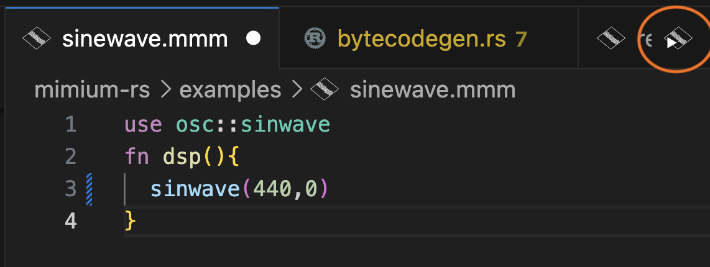
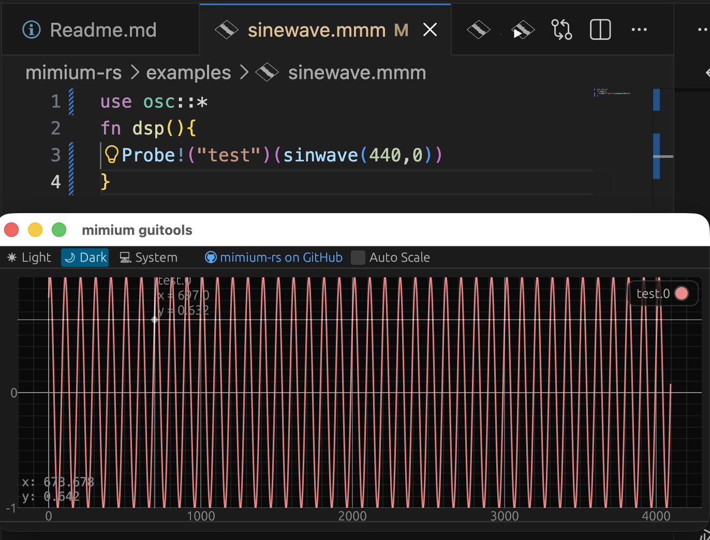
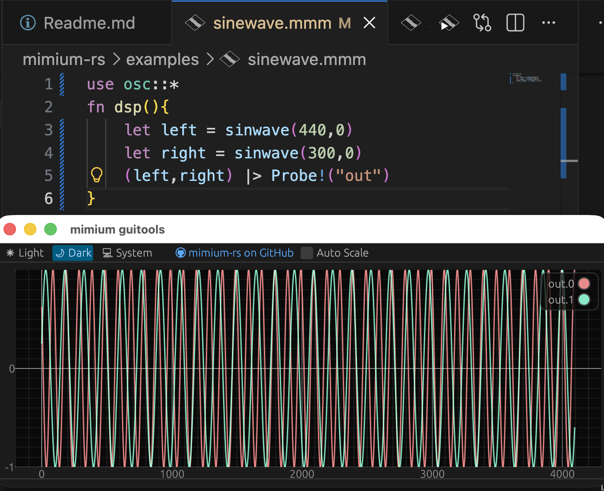
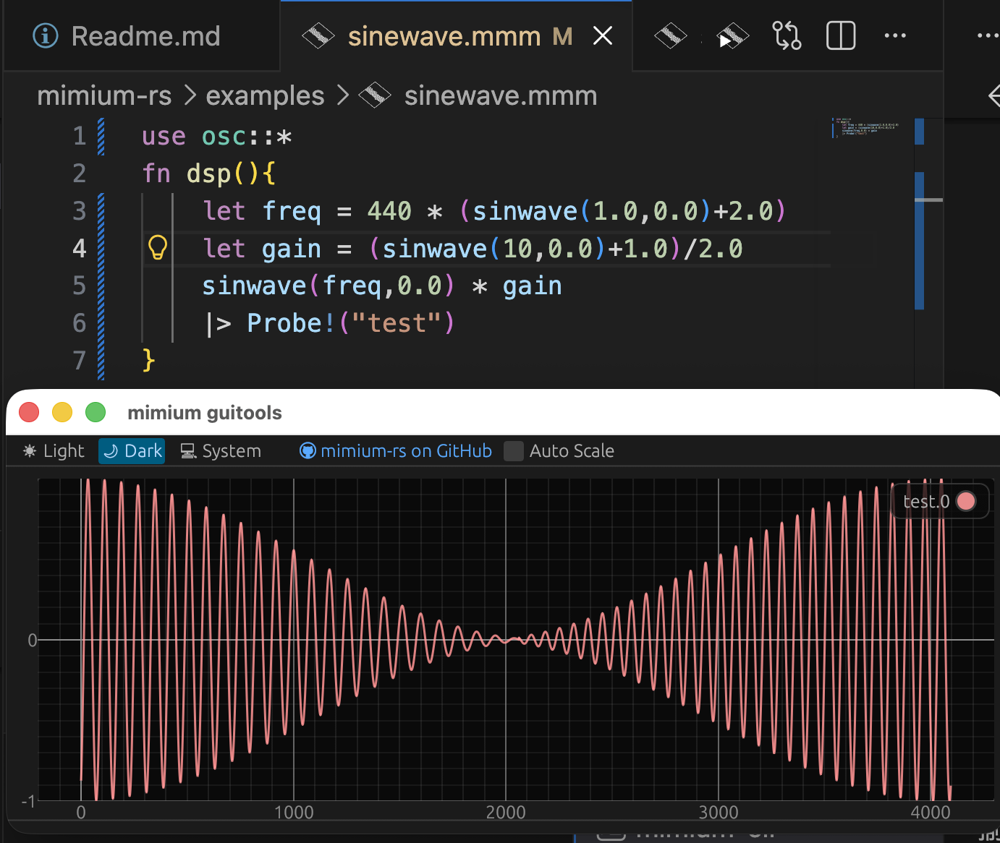

# What is Sound Programming?

In this section, you will learn what it means to create sound using programs and calculations with mimium.

## Creating a 440Hz Sine Wave

1. First, create a file named `hello.mmm`.
2. Paste the following snippet into the file and save it.

```rust
use osc::*
fn dsp(){
  sinwave(440,0)
}
```

Click the play button in the upper right corner of the VSCode file tab to execute the file and hear a 440Hz sine wave (pure tone). Press Enter to stop playback.



## What is Happening Here?

In mimium, and in computer audio in general, sound is represented as a sequence of numbers. These numbers are converted into voltage 48,000 times per second, controlling the speaker’s movement to produce vibrations that reach our ears.

In mimium, you define a function named `dsp` to determine the waveform sent to the audio output. The range of output values (i.e., volume) is between -1 and 1.

Let’s observe the waveform being sent to the audio driver. Add the following to the previous code:

```rust
use osc::*

fn dsp(){
  Probe!("test")(sinwave(440,0))
}
```

When you run this code, a new oscilloscope window will open during execution.



Running `Probe!` returns a new function for sending values to the GUI. The generated function sends the input value to the GUI and returns the same value.

mimium supports the **pipe operator** `|>` to apply functions in a readable way. The following code is equivalent:

```rust
use osc::*

fn dsp(){
    sinwave(440,0)
        |> Probe!("test")
}
```

## Stereo Playback

The previous `dsp` function returned a single value. To output stereo signals, return multiple values as a **tuple**. Let’s change the right channel to 300Hz:

```rust
use osc::*
fn dsp(){
  let left = sinwave(440,0)
  let right = sinwave(300,0)
  (left,right) |> Probe!("out")
}
```

The part `(left,right)` returns the values as a tuple.

Because `Probe` is generic, if you pass a tuple it will display multiple graphs in the GUI.



If you are using headphones, you should hear a lower sound from the right channel compared to the left.

## Frequency and Pitch

The values `440` and `300` are **frequencies**, representing how many times per second the air vibrates. `440Hz` means the speaker moves back and forth 440 times per second. This corresponds to the musical note A4.

You can also modify this frequency with calculations:

```rust
use osc::*

fn dsp(){
  let freq = 440 * (sinwave(1,0)+2)
  sinwave(freq,0)
      |> Probe!("test")
}
```

In this code, the frequency of 440Hz is modulated by a 1Hz sine wave, ranging from 440Hz to 1320Hz.

With underscore partial application and macro pipe `||>`, you can also write this without binding `freq`:

```rust
use osc::*
fn dsp(){
  440 * (sinwave(1,0)+2)
  ||> sinwave(_,0)
  |> Probe!("test")
}
```

## Volume Control

The range of values sent to the audio driver is -1 to 1. If you continuously send `0`, the speaker will produce silence.

To reduce the volume by half, multiply the output by `0.5`. (Note: reducing the waveform amplitude by half does not necessarily mean the perceived volume is halved.)

```rust
use osc::*

fn dsp(){
  440 * (sinwave(1.0,0.0)+2.0)
  ||> sinwave(_,0.0) * 0.5
      |> Probe!("test")
}
```

You can also modulate the volume with a sine wave, creating a **tremolo** effect:

```rust
use osc::*

fn dsp(){
  let freq = 440 * (sinwave(1.0,0.0)+2.0)
  let gain = (sinwave(10,0.0)+1.0)/2.0
  sinwave(freq,0.0) * gain
    |> Probe!("test")
}
```

You should see the waveform change according to the volume curve.



As you increase the tremolo frequency from 3Hz to around 20Hz, the volume changes will sound like a low pitch. This is because 20Hz is the lowest frequency humans perceive as sound.

Effects achieved by multiplying waveforms above 20Hz are called **ring modulation (RM)** or **amplitude modulation (AM)**. Similarly, effects that rapidly change frequency are known as **frequency modulation (FM)**.
